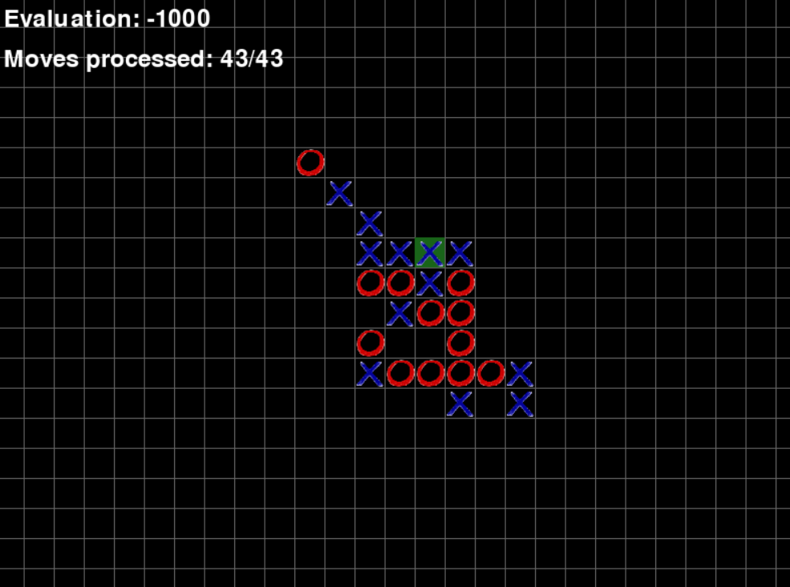

# Endless tic-tac-toe  
This project is an application in which you can play tic-tac-toe against a bot on an endless board. 
The first one to get 5 X's or O's in a row wins

### How is this bot optimized?  
- Bot uses alpha-beta puring optimization  
- The bot does not copy the board to pass it to the minimax function. Instead, the function is passed a set of moves that need to be made on the original board to get the current one
- The bot considers only moves around the crosses and zeros already marked on the board, which reduces search
- To assess the “quality” of the board, the entire board is not scanned, but the previous quality and how much the last move changed it are added up. Which allows you to evaluate the quality of the board in $O(1)$
  
### How to install this project  
1. Clone the repository  
2. Run command `pip install -r requirements.txt`. If it doesn't work try `pip3 install -r requirements.txt`  
3. Run file `main.py`

Thank you for your interest in my project!